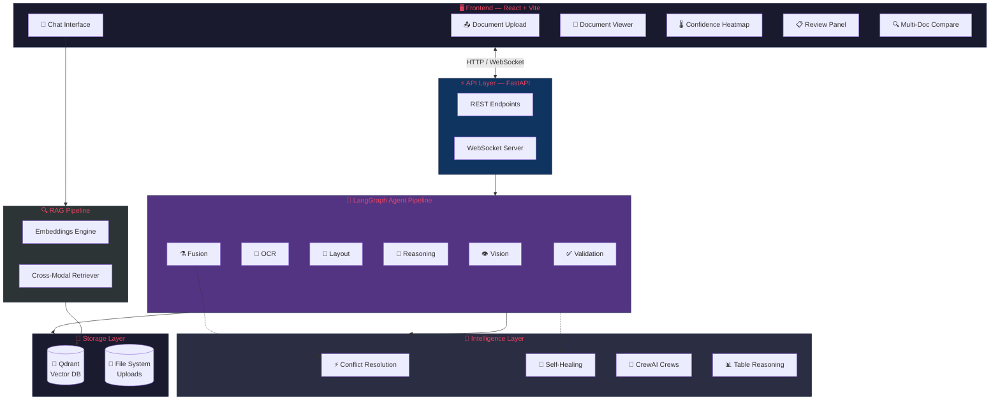
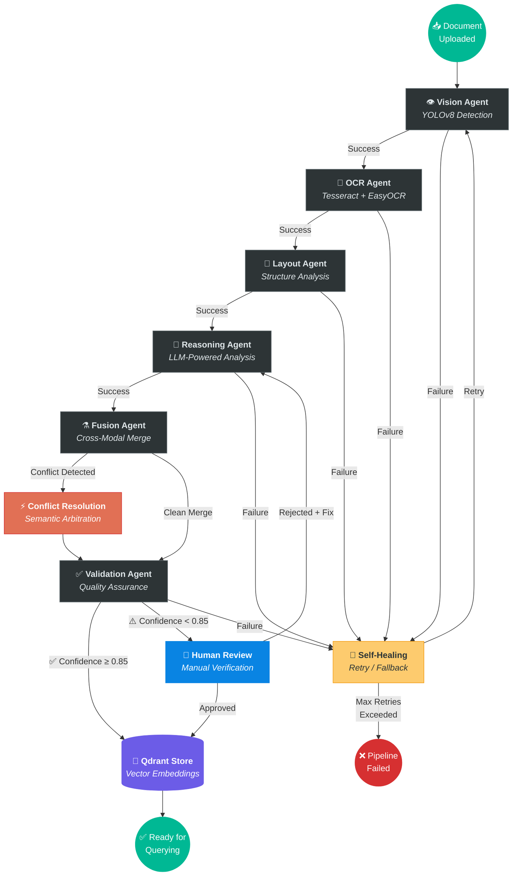
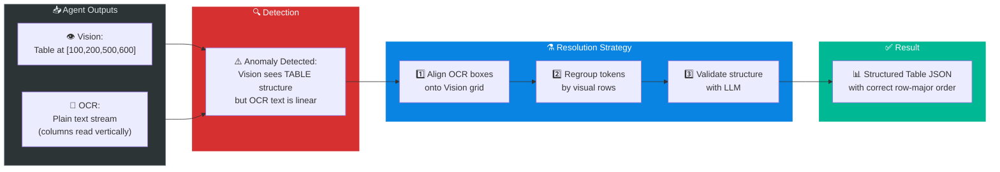
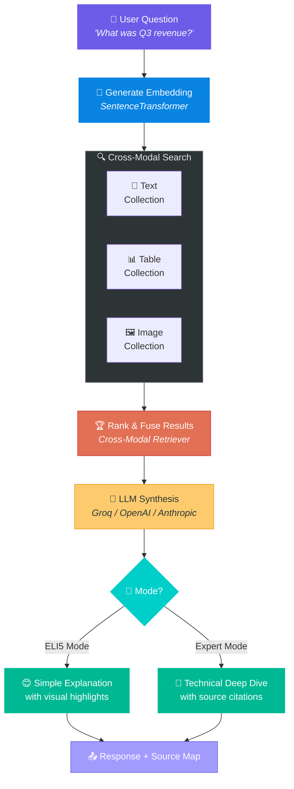

<div align="center">

<br>

# 🧠 AI Agent Builder — Multi-Modal Document Intelligence Platform

### _Construct Knowledge from Chaos_

<br>

[](https://www.python.org)
[](https://fastapi.tiangolo.com)
[](https://reactjs.org)
[](https://langchain.com)
[](https://www.crewai.com)
[](https://qdrant.tech)
[](https://www.docker.com)
[](LICENSE)
[](https://github.com/features/actions)
[](https://docs.ultralytics.com)

---

<h3>🏆 A production-grade, 6-agent AI system that <b>sees</b>, <b>reads</b>, <b>reasons</b>, <b>debates</b>, and <b>self-heals</b><br>to extract near-perfect insights from any document.</h3>

<br>

| 📄 Upload Any Document | 🤖 6 AI Agents Collaborate | 💡 Get Expert Answers |
|:---:|:---:|:---:|
| PDF, PNG, JPG, scans | Vision · OCR · Layout · Reasoning · Fusion · Validation | ELI5 or Expert mode with source citations |

</div>

<br>

---

## 📖 Table of Contents

- [Why This Platform?](#-why-this-platform)
- [Key Capabilities](#-key-capabilities)
- [System Architecture](#-system-architecture)
- [Agent Pipeline Flowchart](#-agent-pipeline-flowchart)
- [Conflict Resolution Deep Dive](#-conflict-resolution-deep-dive)
- [RAG Query Flow](#-rag-query-flow)
- [Technology Stack](#-technology-stack)
- [Project Structure](#-project-structure)
- [Quick Start](#-quick-start)
- [API Reference](#-api-reference)
- [Running Tests](#-running-tests)
- [Deployment](#-deployment)
- [Roadmap](#-roadmap)
- [Contributing](#-contributing)
- [License](#-license)

---

## 🚀 Why This Platform?

Traditional document processing breaks when documents get complex — **tables span pages, charts contain critical data, headers get misread, and OCR garbles structured layouts.**

Most tools use a single linear pipeline: `OCR → Text → Done`. That's not good enough.

**We built a 6-agent collaborative AI system that works like a team of expert analysts:**

```
  ┌─────────────────────────────────────────────────────────────────┐
  │                                                                 │
  │   👁️  SEE it        →  Computer Vision detects layout regions   │
  │   📝  READ it       →  Dual OCR engines extract every word      │
  │   📐  STRUCTURE it  →  Layout analysis reconstructs tables      │
  │   🧠  REASON about  →  LLM understands context & meaning        │
  │   ⚗️  DEBATE it     →  Conflict Resolution fuses disagreements  │
  │   ✅  VERIFY it     →  Validation + Human-in-the-loop QA        │
  │                                                                 │
  └─────────────────────────────────────────────────────────────────┘
```

> **Result:** Where traditional OCR pipelines achieve ~70-80% accuracy on complex documents, our conflict-aware fusion system targets **99%+ accuracy** by resolving disagreements between modalities.

---

## 🏆 Key Capabilities

<table>
<tr>
<td width="33%">

### 🧠 Intelligent Processing
- **Conflict-Aware Fusion** — Auto-detects when OCR disagrees with Vision and resolves via semantic logic
- **Table Intelligence** — Reconstructs complex tables, performs SQL-like queries (Sum, Trend, Filter)
- **Multi-Modal RAG** — Cross-references text, tables, and images simultaneously

</td>
<td width="33%">

### ⚡ Enterprise-Grade
- **Self-Healing Pipeline** — Auto-retries failed agents with fallback strategies
- **Hardware Agnostic** — Runs on CPU (quantized) or GPU (full precision)
- **Containerized** — Docker + Docker Compose, Kubernetes-ready

</td>
<td width="33%">

### 🎨 Premium UX
- **Visual Grounding** — Highlights exact source regions on documents
- **Confidence Heatmaps** — Color-coded overlays for low-confidence areas
- **ELI5 vs Expert** — Toggle between simple and technical explanations
- **Voice Queries** — Ask questions by speaking

</td>
</tr>
</table>

---

## 🏗️ System Architecture

The platform uses a **hybrid LangGraph + CrewAI** architecture. LangGraph provides deterministic state-machine control over the 6-agent pipeline, while CrewAI orchestrates higher-level analytical crews (Analyst, Fact-Checker, Summarizer).



---

## 🔄 Agent Pipeline Flowchart

This is the core document processing pipeline. Each agent has defined transitions, error recovery paths, and conditional routing based on processing results.



---

## ⚔️ Conflict Resolution Deep Dive

When OCR and Vision disagree (e.g., a table is detected visually but OCR reads it as plain text), the **Conflict Resolution Engine** arbitrates using semantic logic.



---

## 🔍 RAG Query Flow

When a user asks a question, the Multi-Modal RAG pipeline retrieves answers from text, tables, and images simultaneously.



---

## 🛡️ Technology Stack

<div align="center">

| Layer | Technology | Purpose |
|:---|:---|:---|
| **🤖 Agent Orchestration** | **LangGraph** | Deterministic state-machine pipeline with cyclic recovery |
| **👥 Crew Orchestration** | **CrewAI** | High-level multi-agent analysis (Analyst, Fact-Checker, Summarizer) |
| **🧠 LLM Intelligence** | **Llama 3.1** / OpenAI / Anthropic / Groq | Contextual reasoning & natural language generation |
| **👁️ Computer Vision** | **YOLOv8** (Ultralytics) + OpenCV | Document layout detection & region classification |
| **📝 OCR Engine** | **Tesseract** + **EasyOCR** | Hybrid dual-engine text extraction for max accuracy |
| **🔮 Vector Database** | **Qdrant** | Persistent vector storage with cross-modal collections |
| **🔢 Embeddings** | **SentenceTransformer** | Semantic embeddings for text, tables, and images |
| **⚡ API Framework** | **FastAPI** + WebSockets | Async REST API with real-time progress updates |
| **🎨 Frontend** | **React 18** + Vite + CSS | Premium UI with heatmaps, chat, document viewer |
| **🐳 Containerization** | **Docker** + Docker Compose | One-command deployment with isolated services |
| **🚀 CI/CD** | **GitHub Actions** | Automated testing, linting, and deployment pipelines |
| **📄 PDF Processing** | pdf2image + pdfplumber + PyPDF2 | Multi-engine PDF text & image extraction |

</div>

---

## 📁 Project Structure

```
AI-Agent_Builder/
│
├── 🔧 backend/                    # Python Backend
│   ├── agents/                    # 🤖 Core AI Agent System
│   │   ├── workflow.py            #    LangGraph pipeline definition
│   │   ├── vision_agent.py        #    👁️ YOLOv8 document layout detection
│   │   ├── ocr_agent.py           #    📝 Dual OCR (Tesseract + EasyOCR)
│   │   ├── layout_agent.py        #    📐 Structure reconstruction
│   │   ├── text_reasoning_agent.py#    🧠 LLM-powered text analysis
│   │   ├── table_reasoning_agent.py#   📊 Table-specific reasoning & queries
│   │   ├── fusion_agent.py        #    ⚗️ Cross-modal fusion
│   │   ├── validation_agent.py    #    ✅ Quality assurance & confidence
│   │   ├── conflict_resolution.py #    ⚡ OCR vs Vision arbitration
│   │   ├── self_healing.py        #    🏥 Auto-retry & fallback strategies
│   │   ├── crew_orchestrator.py   #    👥 CrewAI multi-agent crews
│   │   ├── voice_agent.py         #    🎤 Voice query transcription
│   │   ├── confidence_heatmap.py  #    🌡️ Visual confidence overlays
│   │   └── state.py               #    📋 DocumentState definition
│   │
│   ├── api/                       # ⚡ FastAPI Application
│   │   ├── main.py                #    App entry point & middleware
│   │   ├── routes/                #    Endpoint definitions
│   │   └── websocket.py           #    Real-time progress updates
│   │
│   ├── cv/                        # 👁️ Computer Vision Module
│   │   └── preprocessor.py        #    Image preprocessing pipeline
│   │
│   ├── ocr/                       # 📝 OCR Module
│   │
│   ├── rag/                       # 🔍 RAG Pipeline
│   │   ├── rag_pipeline.py        #    Query orchestration
│   │   ├── cross_modal_retriever.py#   Multi-collection search
│   │   ├── embeddings.py          #    SentenceTransformer embeddings
│   │   ├── vector_store.py        #    Qdrant integration
│   │   └── retriever.py           #    Base retriever
│   │
│   ├── tests/                     # 🧪 Backend Tests (pytest)
│   ├── config.py                  #    Environment configuration
│   └── requirements.txt           #    Python dependencies
│
├── 🎨 frontend/                   # React Frontend
│   └── src/
│       ├── components/
│       │   ├── DocumentUpload.jsx  #    📤 Drag & drop file upload
│       │   ├── ChatInterface.jsx   #    💬 ELI5/Expert chat with RAG
│       │   ├── DocumentViewer.jsx  #    📄 Rendered document with overlays
│       │   ├── ConfidenceHeatmap.jsx#   🌡️ Visual confidence maps
│       │   ├── ReviewPanel.jsx     #    📋 Human-in-the-loop review
│       │   ├── MultiDocumentCompare.jsx # 🔍 Side-by-side comparison
│       │   └── Header.jsx          #    🔝 Navigation & theme toggle
│       ├── App.jsx                 #    Root component
│       └── index.css               #    Design system & tokens
│
├── 🐳 docker/                     # Docker Configuration
│   ├── Dockerfile.backend         #    Backend container
│   └── Dockerfile.frontend        #    Frontend container
│
├── ⚙️ .github/workflows/          # CI/CD Pipelines
├── docker-compose.yml             # One-command stack launch
├── Makefile                       # Developer shortcuts
└── technical_report.md            # Architecture Decision Records
```

---

## ⚡ Quick Start

### Prerequisites

- **Python 3.11+** · **Node.js 18+** · **Docker** (optional)
- An API key from **Groq**, **OpenAI**, or **Anthropic**

---

### 🐳 Option 1: Docker (Recommended)

Get the entire stack running in **2 minutes**.

```bash
# 1. Clone the repository
git clone https://github.com/gopika-repo/AI-Agent_Builder.git
cd AI-Agent_Builder

# 2. Configure environment
cp backend/.env.example backend/.env
# Edit backend/.env and add your API key:
#   GROQ_API_KEY=your_key_here

# 3. Launch the full stack
docker-compose up -d --build
```

> **🌐 Access Points:**
> | Service | URL |
> |:---|:---|
> | Frontend | `http://localhost:3000` |
> | API Docs | `http://localhost:8000/docs` |
> | API Health | `http://localhost:8000/health` |

---

### 💻 Option 2: Local Development

For developers who want to modify agents and iterate quickly.

**Backend:**
```bash
cd backend
python -m venv venv
source venv/bin/activate    # Windows: venv\Scripts\activate
pip install -r requirements.txt
uvicorn api.main:app --reload --port 8000
```

**Frontend:**
```bash
cd frontend
npm install
npm run dev
```

---

### 🔧 Environment Variables

Create `backend/.env` with:

```env
# Required — at least one LLM provider
GROQ_API_KEY=your_groq_api_key

# Optional — additional providers
OPENAI_API_KEY=your_openai_key
ANTHROPIC_API_KEY=your_anthropic_key

# Optional — Qdrant (defaults to in-memory)
QDRANT_HOST=localhost
QDRANT_PORT=6333
```

---

## 📡 API Reference

| Method | Endpoint | Description |
|:---|:---|:---|
| `POST` | `/api/documents/upload` | Upload a document (PDF, PNG, JPG) |
| `GET` | `/api/documents/{id}/status` | Check processing status |
| `GET` | `/api/documents/{id}/results` | Get extraction results |
| `POST` | `/api/chat/{id}/query` | Ask a question (ELI5 / Expert) |
| `POST` | `/api/chat/{id}/voice` | Voice query (audio upload) |
| `GET` | `/api/documents/{id}/confidence` | Get confidence heatmap |
| `POST` | `/api/review/{id}/submit` | Submit human review decision |
| `WS` | `/ws/{document_id}` | Real-time processing updates |

> 📖 **Interactive docs:** Visit `http://localhost:8000/docs` for the full Swagger UI

---

## 🧪 Running Tests

```bash
# Backend tests
cd backend
pytest tests/ -v --cov=. --cov-report=term-missing

# Frontend tests
cd frontend
npm test

# Full suite via Makefile
make test
```

---

## 📊 Benchmarks

The project includes a **quantitative evaluation suite** for measuring pipeline accuracy against ground-truth datasets.

```bash
# Run the evaluation benchmark
python -m benchmarks.evaluate_pipeline

# Custom dataset
python -m benchmarks.evaluate_pipeline --dataset path/to/ground_truth.json
```

| Metric | What It Measures |
|:---|:---|
| **Text Extraction F1** | Word-level precision, recall, and character accuracy |
| **Table Structure Accuracy** | Cell-level F1, row/column correctness |
| **Layout Detection IoU** | Bounding box accuracy for detected regions |
| **Conflict Resolution Rate** | Detection rate, resolution accuracy, confidence delta |

> 📖 See [`benchmarks/README.md`](benchmarks/README.md) for full documentation.

---

## 🚢 Deployment

<details>
<summary><b>🔵 Deploy Backend to Render</b></summary>

1. Create a new **Web Service** on [Render](https://render.com)
2. Connect your GitHub repository
3. Set build command: `pip install -r backend/requirements.txt`
4. Set start command: `uvicorn backend.api.main:app --host 0.0.0.0 --port $PORT`
5. Add environment variables (`GROQ_API_KEY`, etc.)

</details>

<details>
<summary><b>🟣 Deploy Frontend to Vercel</b></summary>

1. Import project on [Vercel](https://vercel.com)
2. Set root directory to `frontend`
3. Set framework preset to **Vite**
4. Add environment variable: `VITE_API_URL=https://your-backend.onrender.com`

</details>

---

## 🗺️ Roadmap

- [x] 🤖 6-Agent LangGraph Pipeline (Vision → OCR → Layout → Reasoning → Fusion → Validation)
- [x] ⚡ Conflict-Aware Fusion Engine
- [x] 🏥 Self-Healing Pipeline with retry & fallback
- [x] 🔍 Multi-Modal RAG (Text + Table + Image retrieval)
- [x] 🌡️ Confidence Heatmaps & Visual Grounding
- [x] 👤 Human-in-the-Loop Review Panel
- [x] 🎤 Voice Query Interface
- [x] 👥 CrewAI Multi-Agent Analysis Crews
- [x] 📊 Table Reasoning Agent (SQL-like queries on tables)
- [x] 🌗 Light / Dark Mode
- [x] 🐳 Docker + Docker Compose with Health Checks
- [x] 🚀 CI/CD with GitHub Actions
- [x] 📊 Quantitative Evaluation Benchmark Suite
- [x] 📱 Responsive UI Design

---

## 🤝 Contributing

Contributions are welcome! Please read [CONTRIBUTING.md](CONTRIBUTING.md) for guidelines.

```bash
# Setup pre-commit hooks
pip install pre-commit
pre-commit install

# Code formatting
make format

# Linting
make lint
```

---

## 📄 License

Distributed under the **MIT License**. See [LICENSE](LICENSE) for details.

---

<div align="center">

<br>

**Built with ❤️ using LangGraph, CrewAI, YOLOv8, and Qdrant**

_If this project helped you, consider giving it a ⭐_

<br>

</div>
